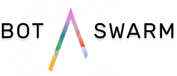

<!--  
  <a href="#">Link 1</a> |
  <a href="#">Link 2</a> |
  <a href="#">Link 3</a>
  -->
    
  

# WIP DO NOT USE YET, PRS welcome :)

## Usage

### Getting started

1. clone and cd into directory
2. `npm install`
3. copy `.env.example` to `.env`.
4. create a new slack bot in your slack organization, put the api key in `.env`.
5. [create a new slack app](https://api.slack.com/apps)
6. add the slack bot to your slack app (your app > Bot Users)
7. add event subscriptions to your app (Event Subscriptions > Bot Events). You need at least message.channels, message.im, message.mpim.
8. run `node ./src/cli/mn.js`

## Brain dumping

### Bootstrap Stages

1. Parse config
2. Bring up webservers (express, used for webhooks)
3. Bring up BotSwarm
